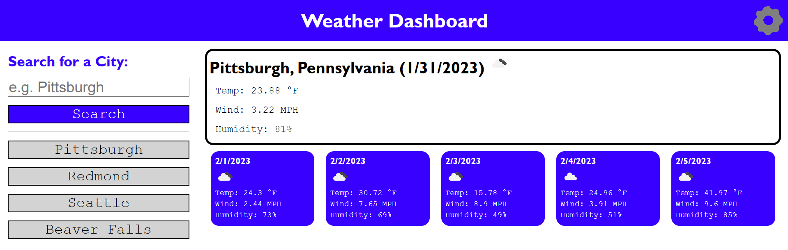

# Weather Dashboard

## Table of Contents
  
* [Description](#description)
* [Usage](#usage)
* [Questions](#questions)

## Description

This website allows a user to search for any city and be given a formatted display of current weather conditions, as well as a five day forecast. Each forecast card displays weather data from three hours earlier than the current data on its respective day. As searches are made, the most recent ten searches are conveniently stored in buttons along the side.

## Usage

Upon opening the page, you will find a search bar to the left. If you have made any searches in the past locally, up to the last ten will be stored in buttons. The city from your most recent search will pop up as results if you have one. Pressing the past search buttons will search for weather data for these cities. Formatted results for current weather and the next five days will appear to the right. The settings cog at the top-right of the page will pop up a modal which allows you to select unit types.

Deployed Link: <a href="https://hornickjohn.github.io/weather-dashboard/">https://hornickjohn.github.io/weather-dashboard/</a>

## Questions

Contact with questions/comments:
* GitHub: [hornickjohn](https://github.com/hornickjohn)
* Email: jhornick@live.com
    
